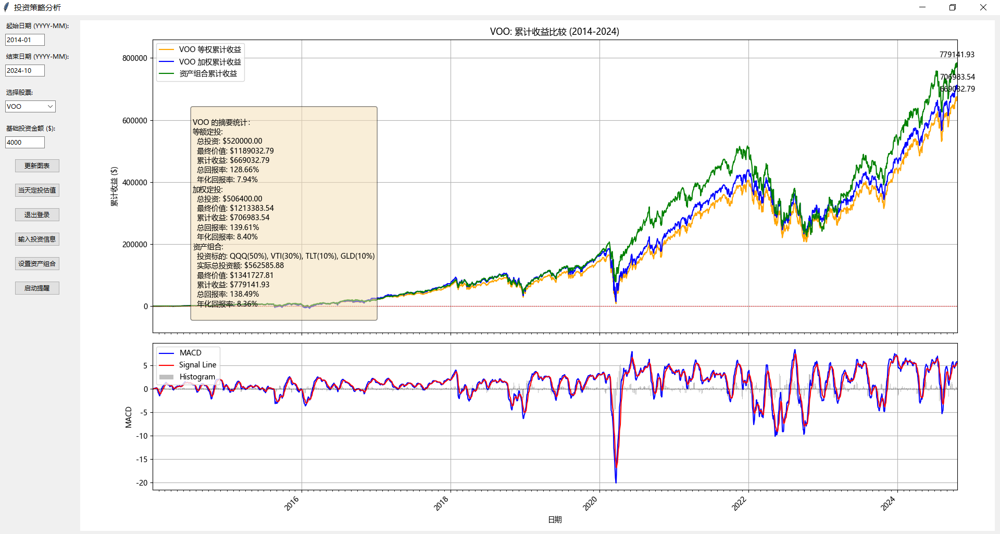
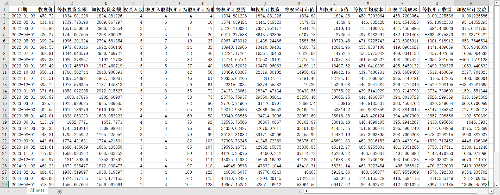

# 投资策略分析工具

## 项目概述

这是一个用Python开发的投资策略分析工具，旨在帮助投资者比较不同的定投策略效果。该工具支持分析美国市场的多种ETF和指数，提供图形化界面，便于用户交互和结果可视化。此外，它还支持通过PushPlus进行定投提醒推送。

## 主要功能

- 支持资产组合的配置和分析
- 提供每日累计收益的精确计算和可视化
- 支持多种投资策略的对比分析：
  - [等额定投策略](docs/investment-strategies.md#等额定投)
  - [加权定投策略](docs/investment-strategies.md#加权定投)
  - [自定义资产组合策略](docs/investment-strategies.md#资产组合策略)
- 导出详细的Excel报告，包含每日投资数据和收益分析
- 显示完整的投资统计信息，包括投资标的配置、累计收益、回报率等

详细功能说明请参考：
- [安装指南](docs/installation.md)
- [使用说明](docs/usage.md)
- [投资策略详解](docs/investment-strategies.md)
- [数据分析与导出](docs/data-analysis.md)

## MileStones

### 短期目标

- [ ] 实现自动保存和加载用户偏好设置
- [ ] 改进图表交互性，支持缩放和数据点悬停显示详情
- [ ] 允许用户进行初始资金定义，以便满足精确的收益计算
- [ ] 支持周/月/季度定投模式，并支持比较相关收益数据
- [ ] 结合汇率影响定投数据

### 中期目标

- [ ] 集成机器学习模型，提供基于历史数据的简单预测
- [ ] 添加投资组合分析功能，支持多股票组合的收益率计算
- [ ] 实现自定义投资策略的导入和使用
- [ ] 增加对股息再投资的模拟
- [ ] 开发网页版应用，提供在线使用功能
- [ ] 支持当天盘中的自定义数据的输入

### 长期目标

- [ ] 集成实时数据流，支持近实时的市场数据分析
- [ ] 开发移动应用版本，提供随时随地的分析能力
- [ ] 实现与主流券商API的集成，支持实盘交易数据导入
- [ ] 添加社区功能，允许用户分享和讨论投资策略
- [ ] 开发高级回测系统，支持更复杂的交易策略和市场情景模拟

### 持续改进

- [ ] 定期更新数据源和API，确保数据的准确性和可靠性
- [ ] 优化用户界面，提高用户体验
- [ ] 扩展对更多国际市场和金融产品的支持
- [ ] 加强代码测试覆盖率，提高软件稳定性
- [ ] 编写详细的用户手册和开发文档

## 注意事项

- 本工具使用yfinance获取历史数据，请确保您有稳定的网络连接。
- 对于中国市场的数据，可能会受到市场和数据源的限制，accuracy可能有所不同。
- 本工具仅供教育和研究目的使用，不构成投资建议。
- 使用PushPlus功能需要注册并获取token，请访问 https://www.pushplus.plus/ 获取更多信息。

详细的技术文档请参考：[技术文档](docs/technical.md)

## 贡献

欢迎提交问题报告和功能建议。如果您想为项目做出贡献，请遵循以下步骤：

1. Fork 本仓库
2. 创建您的特性分支 (`git checkout -b feature/AmazingFeature`)
3. 提交您的更改 (`git commit -m 'Add some AmazingFeature'`)
4. 推送到分支 (`git push origin feature/AmazingFeature`)
5. 开启一个 Pull Request

## 许可证

本项目采用 MIT 许可证 - 详情请见 [LICENSE](LICENSE) 文件。

## 赞赏支持

如果您觉得这个工具对您有帮助，欢迎赞赏支持，这将帮助我们更好地维护和改进这个项目。

| 微信赞赏 | 支付宝赞赏 |
| :---: | :---: |
|  |  |