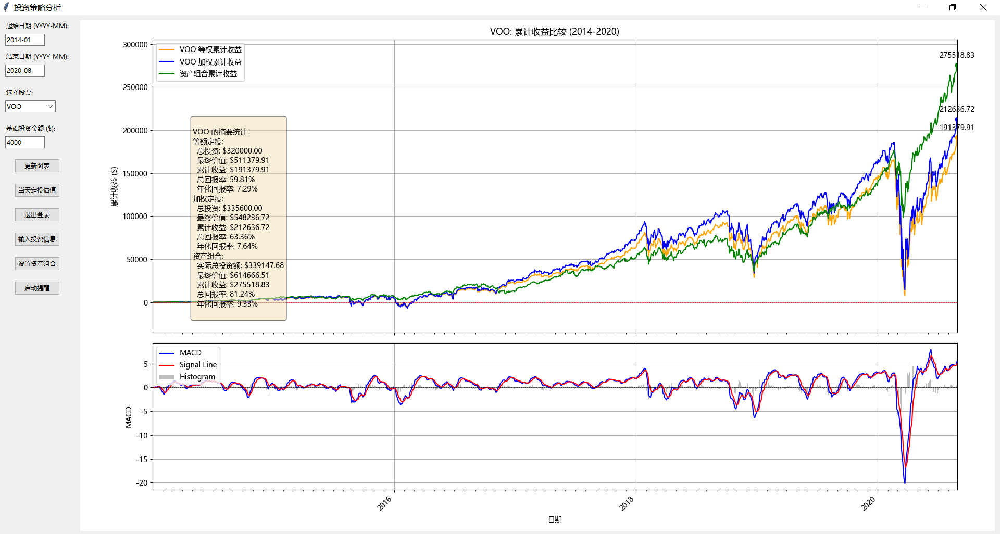
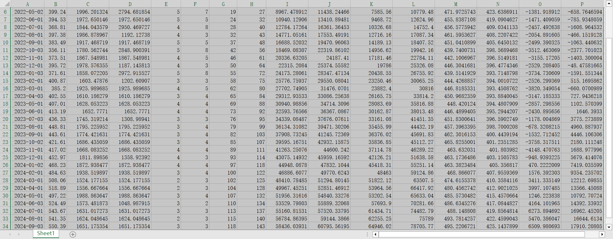

# 投资策略分析工具
## 项目概述

这是一个用Python开发的投资策略分析工具，旨在帮助投资者比较不同的定投策略效果。该工具支持分析美国市场的多种ETF和指数，提供图形化界面，便于用户交互和结果可视化。此外，它还支持通过PushPlus进行定投提醒推送。





## 主要功能

- 支持资产组合的配置和分析
- 提供每日累计收益的精确计算和可视化
- 支持多种投资策略的对比分析：
  - 等额定投策略
  - 加权定投策略
  - 自定义资产组合策略
- 导出详细的Excel报告，包含每日投资数据和收益分析
- 显示完整的投资统计信息，包括投资标的配置、累计收益、回报率等

## 投资策略说明

### 等额定投 vs 加权定投

1. **等额定投**：
   - 定义：每次投资使用相同的金额。
   - 优点：简单易行，不需要复杂的计算。
   - 特点：在市场低迷时买入更多份额，高涨时买入较少份额，自然而然地实现"低买高卖"。

2. **加权定投**：
   - 定义：根据特定的市场指标或条件调整每次的投资金额。
   - 优点：可能获得比等额定投更高的收益，因为它试图利用市场波动。
   - 特点：在我们的工具中，加权定投策略考虑了以下因素：
     - 当前价格与移动平均线的关系
     - 市场的波动性（通过标准差衡量）
     - 相对强弱指标（RSI）
     - 当前持仓与等权持仓的差异

   这种策略旨在在市场低迷时增加投资，在市场可能过热时减少投资。定投策略参考[加权定投指标说明](docs/加权定投指标说明.md)。


### 定投日期选择

我们选择每月第二周的周三作为定投日，原因如下：

1. **稳定性**：选择固定的周和日期可以提供稳定的投资节奏，有助于养成良好的投资习惯。

2. **避开月初和月末**：
   - 月初可能受到前一个月经济数据发布的影响。
   - 月末可能受到各种结算、报告发布等因素的影响。
   选择月中的时间可以避开这些潜在的波动。

3. **周三优势**：
   - 周三通常不受周一可能的剧烈波动和周五获利了结的影响。
   - 它提供了足够的时间来消化周初可能发布的重要信息。

4. **流动性考虑**：中旬的交易日通常有良好的流动性，不太可能出现极端的价格波动。

5. **实用性**：对于需要在工作日处理定投的投资者来说，周三是一个理想的选择，既不太靠近周末，也给予足够的时间来准备资金。

通过选择每月第二周的周三，我们旨在为定期投资创造一个相对稳定和代表性的时间点。然而，用户应该意识到，任何固定的投资日期都可能受到特定事件或市场条件的影响。

### 资产组合策略

1. **组合配置**：
   - 支持多个ETF或指数的组合配置
   - 可以为每个标的设置不同的权重
   - 自动记录和跟踪每个标的的投资情况

2. **收益计算**：
   - 每日计算组合的市值和收益
   - 考虑所有标的的实际持仓和市场价格
   - 提供组合层面的各项指标：
     - 实际总投资额
     - 最终市值
     - 累计收益
     - 总回报率
     - 年化回报率

3. **数据分析和展示**：
   - 图表展示包含三条曲线：
     - 橙色：等额定投累计收益
     - 蓝色：加权定投累计收益
     - 绿色：资产组合累计收益
   - 每日连续的收益数据，而不仅仅是投资日的数据点
   - 清晰显示各投资策略的对比效果

### 数据导出功能

投资数据导出采用统一的命名规则：`股票名_投资数据_起始日期_结束日期.xlsx`，包含以下内容：

1. **投资详情表**：
   - 日期和收盘价
   - 买入股数和实际投资金额
   - 累计持股数和累计投资
   - 累计市值和平均成本
   - 等权和加权策略的对比数据

2. **资产组合详情表**（如果启用）：
   - 各标的的配置比例
   - 实际投资比例
   - 最终持股数
   - 累计投资金额

### 统计信息展示

工具提供详细的统计信息，包括：

1. **等额定投统计**：
   - 总投资额
   - 最终价值
   - 累计收益
   - 总回报率和年化回报率

2. **加权定投统计**：
   - 总投资额
   - 最终价值
   - 累计收益
   - 总回报率和年化回报率

3. **资产组合统计**：
   - 投资标的及其配置比例
   - 实际总投资额
   - 最终价值
   - 累计收益
   - 总回报率和年化回报率
## 安装说明

1. 确保您的系统已安装Python 3.7+
2. 克隆此仓库到本地：
   ```
   git clone https://github.com/yourusername/InvestmentTools.git
   ```
3. 进入项目目录：
   ```
   cd InvestmentTools
   ```
4. 安装所需依赖：
   ```
   pip install -r requirements.txt
   ```

## 使用方法

### GUI模式

1. 运行主程序：
   ```
   python main.py
   ```
2. 在图形界面中：
   - 选择要分析的股票/ETF
   - 设置起始和结束日期
   - 输入基础投资金额
   - 点击"更新图表"按钮生成分析结果
   - 使用"PushPlus登录"按钮进行登录以启用推送功能
   - 使用"当天定投估值"按钮查看当日投资建议
   - 使用"启动提醒"按钮开启定期投资提醒

### CLI模式

1. 使用以下命令运行CLI模式：
   ```
   python main.py --cli [options]
   ```
   可用的选项包括：
   - `--login TOKEN`: 使用PushPlus token登录
   - `--estimate`: 估算今日投资
   - `--start-reminder`: 启动投资提醒

例如：
```
python main.py --cli --login your_pushplus_token --estimate
```

## 依赖项

主要依赖项包括：

- yfinance
- pandas
- numpy
- matplotlib
- tkinter
- pytz
- requests
- schedule

详细的依赖列表请参见 `requirements.txt` 文件。

## MileStones

以下是我们计划在未来版本中实现的功能和改进：

### 短期目标

- [ ] 实现自动保存和加载用户偏好设置
- [ ] 改进图表交互性，支持缩放和数据点悬停显示详情
- [ ] 允许用户进行初始资金定义，以便满足精确的收益计算
- [ ] 支持周/月/季度定投模式，并支持比较相关收益数据
- [ ] 结合汇率影响定投数据

### 中期目标

- [ ] 集成机器学习模型，提供基于历史数据的简单预测
- [ ] 添加投资组合分析功能，支持多股票组合的收益率计算
- [ ] 实现自定义投资策略的导入和使用
- [ ] 增加对股息再投资的模拟
- [ ] 开发网页版应用，提供在线使用功能
- [ ] 支持当天盘中的自定义数据的输入

### 长期目标

- [ ] 集成实时数据流，支持近实时的市场数据分析
- [ ] 开发移动应用版本，提供随时随地的分析能力
- [ ] 实现与主流券商API的集成，支持实盘交易数据导入
- [ ] 添加社区功能，允许用户分享和讨论投资策略
- [ ] 开发高级回测系统，支持更复杂的交易策略和市场情景模拟

### 持续改进

- [ ] 定期更新数据源和API，确保数据的准确性和可靠性
- [ ] 优化用户界面，提高用户体验
- [ ] 扩展对更多国际市场和金融产品的支持
- [ ] 加强代码测试覆盖率，提高软件稳定性
- [ ] 编写详细的用户手册和开发文档

我们欢迎社区成员参与到这些目标的实现中来。如果您对某个特定的功能特别感兴趣或有好的建议，请在Issues中提出或直接贡献代码。

## 注意事项

- 本工具使用yfinance获取历史数据，请确保您有稳定的网络连接。
- 对于中国市场的数据，可能会受到市场和数据源的限制，accuracy可能有所不同。
- 本工具仅供教育和研究目的使用，不构成投资建议。
- 使用PushPlus功能需要注册并获取token，请访问 https://www.pushplus.plus/ 获取更多信息。

## 贡献

欢迎提交问题报告和功能建议。如果您想为项目做出贡献，请遵循以下步骤：

1. Fork 本仓库
2. 创建您的特性分支 (`git checkout -b feature/AmazingFeature`)
3. 提交您的更改 (`git commit -m 'Add some AmazingFeature'`)
4. 推送到分支 (`git push origin feature/AmazingFeature`)
5. 开启一个 Pull Request

## 许可证

本项目采用 MIT 许可证 - 详情请见 [LICENSE](LICENSE) 文件。